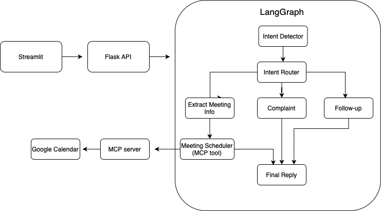

# Email Reply Assistant  - Generative AI Project

This project is an AI-powered assistant that reads incoming email content and generates human-like replies. It also supports  meeting scheduling by connecting to Google Calendar via a Model Context Protocol (MCP) tool.

## Features

- Intent detection (e.g., meeting request, complaint, follow-up)
- Smart reply generation using OpenAI GPT-4o-mini
- Meeting scheduling via Google Calendar MCP tool
- Multi-agent system with LangGraph routing
- Full observability with LangSmith (step-by-step node tracing)
- Streamlit-based user interface

## Project Structure

```
email-reply/
├── backend/
│   ├── app.py                    Flask API backend exposing /api/chat
│   ├── agent_graph.py            LangGraph multi-agent workflow (intent → routed agents)
│
├── frontend/
│   └── frontend_app.py           Streamlit app UI 
│
├── mcp_tools/
│   └── calendar-mcp/             External MCP server for Google Calendar (via FastAPI)
│       ├── run_server.py         MCP server entrypoint
│       └── ...                   Tool definitions (create_event, etc.)
│
├── config/
│   └── .env                      API keys and configuration variables
│
├── requirements.txt              Python package dependencies
├── README.md                     Project documentation
├── architecture.png              Architecture diagram 
└── .gitignore                    Excludes .env, .venv, etc.
```

## Architecture Diagram

The system consists of a Streamlit frontend, a Flask API backend, a LangGraph-based agent workflow, and an MCP-compliant Google Calendar tool 



## Setup Instructions

1. Clone the Repository

   ```bash
   git clone https://github.com/your-username/email-reply.git
   cd email-reply
   ```

2. Set Up Virtual Environment

   ```bash
   python -m venv .venv
   source .venv/bin/activate      # On Windows: .venv\Scripts\activate
   pip install -r requirements.txt
   ```

3. Create a `.env` File

   Add the following to `config/.env`:

   ```
   OPENAI_API_KEY=your-openai-key
   LANGCHAIN_API_KEY=your-langsmith-key
   LANGCHAIN_TRACING_V2=true
   LANGCHAIN_PROJECT=email-reply-project
   ```

4. Run the Application

   - Backend (Flask):
     ```bash
     python backend/app.py
     ```

   - Frontend (Streamlit):
     ```bash
     streamlit run frontend/frontend_app.py
     ```

   - Calendar MCP Server:
     ```bash
     python mcp_tools/calendar-mcp/run_server.py
     ```

## Usage

- Paste an email into the frontend text box.
- Click Generate Reply.
- If the email is a meeting request:
  - The assistant will detect the intent.
  - It will extract the relevant time, date, and contact information.
  - It will schedule the meeting using Google Calendar via MCP.
  - It will return a natural-language confirmation reply.

## Tech Stack

- Python 3.10+
- Flask (API backend)
- Streamlit (frontend UI)
- LangGraph + LangChain (multi-agent orchestration)
- OpenAI GPT-4o-mini (LLM backend)
- Google Calendar API (via custom MCP tool)
- LangSmith (for tracing and observability)

## Licensing and Citations

This project incorporates open-source components with appropriate attribution, in accordance with university academic integrity policies.

### MCP Tool: Google Calendar Integration

We use a prebuilt Model Context Protocol (MCP) server to handle Google Calendar scheduling.

- Source: [`calendar-mcp`](https://github.com/deciduus/calendar-mcp)
- Author: [deciduus](https://github.com/deciduus)
- License: [MIT License](https://github.com/deciduus/calendar-mcp/blob/main/LICENSE)
- Swagger documentation available at runtime:
  [http://127.0.0.1:8000/docs#/Events/create_event](http://127.0.0.1:8000/docs#/Events/create_event)

The MCP tool was used without modification and integrated via HTTP requests in accordance with its license. 

The MCP tool server is included in this repo under mcp_tools/calendar-mcp, forked from calendar-mcp. It was used without modification (except for configuration) and is required to test meeting scheduling.

### Other External Tools and APIs

- OpenAI GPT-4o-mini — used via OpenAI API to generate replies
- LangChain and LangGraph — used for multi-agent logic
- LangSmith — used for debugging and tracing via observability layer

All external resources were used exclusively for academic and educational purposes.

## Credits

Created by Anna Seweryn-Pilarska  
For the TEG Generative AI course project (2025)
